# HOTSHOT — Références COMIC v2

**26/26 nouvelles images 3/4 générées.** Cyan électrique, jaune, rose et violet, encrage noir et ombres cel-shading.

Chaque image est accompagnée de son prompt exact et du GLB + PNG à livrer. Les références servent à la reconstruction : aucun des nouveaux GLB n’a encore été livré. Le fusil actuel conserve sa géométrie précédente avec des matériaux toon provisoires.

Les images sont transparentes et les objets entiers. Leurs marges sont généralement plus serrées que demandé ; quelques biseaux gardent des reflets doux. Pour le GLB, utiliser des aplats stricts, sans texture de lumière peinte. Les réserves de forme par asset figurent dans [le journal de génération](comic/index.json).

[Consignes et dimensions](ASSET_PRODUCTION.md) · [Déposer GLB + PNG](incoming/) · [Ancienne DA](archive/industrial-v1/REFERENCES.md)

## Lot A — Gunner, armes et bras FPS

### Gunner — `char_gunner`

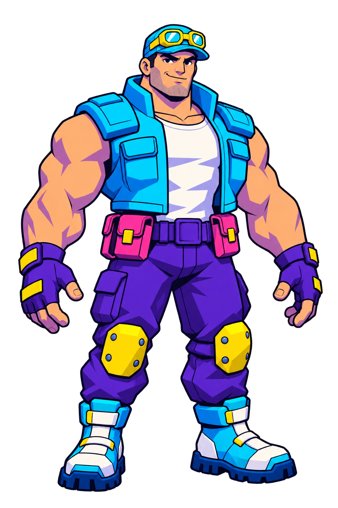

[PNG original](comic/references/char_gunner_comic_v1.png) · [Prompt exact](comic/prompts/char_gunner.txt)

À livrer : `char_gunner.glb` + `char_gunner.png`. Taille cible : **1,85 m de haut**.

### Assault Rifle — `weapon_assault_rifle`

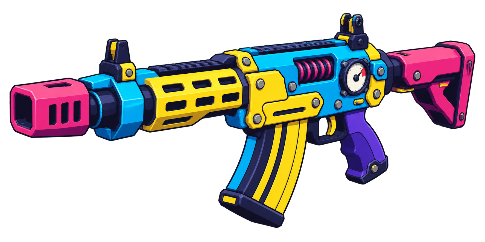

[PNG original](comic/references/weapon_assault_rifle_comic_v1.png) · [Prompt exact](comic/prompts/weapon_assault_rifle.txt)

À livrer : `weapon_assault_rifle.glb` + `weapon_assault_rifle.png`. Taille cible : **1,05 m de long**.

### Grenade Launcher — `weapon_grenade_launcher`

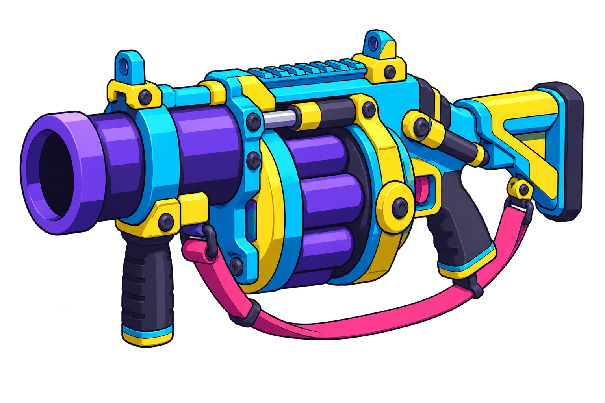

[PNG original](comic/references/weapon_grenade_launcher_comic_v1.png) · [Prompt exact](comic/prompts/weapon_grenade_launcher.txt)

À livrer : `weapon_grenade_launcher.glb` + `weapon_grenade_launcher.png`. Taille cible : **0,85 m de long**.

### Grenade — `projectile_grenade`

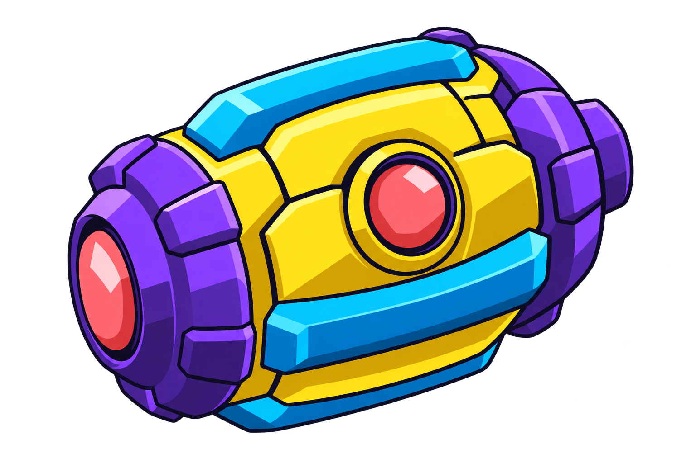

[PNG original](comic/references/projectile_grenade_comic_v1.png) · [Prompt exact](comic/prompts/projectile_grenade.txt)

À livrer : `projectile_grenade.glb` + `projectile_grenade.png`. Taille cible : **0,28 m de diamètre**.

### Bras FPS du Gunner — `arms_gunner`

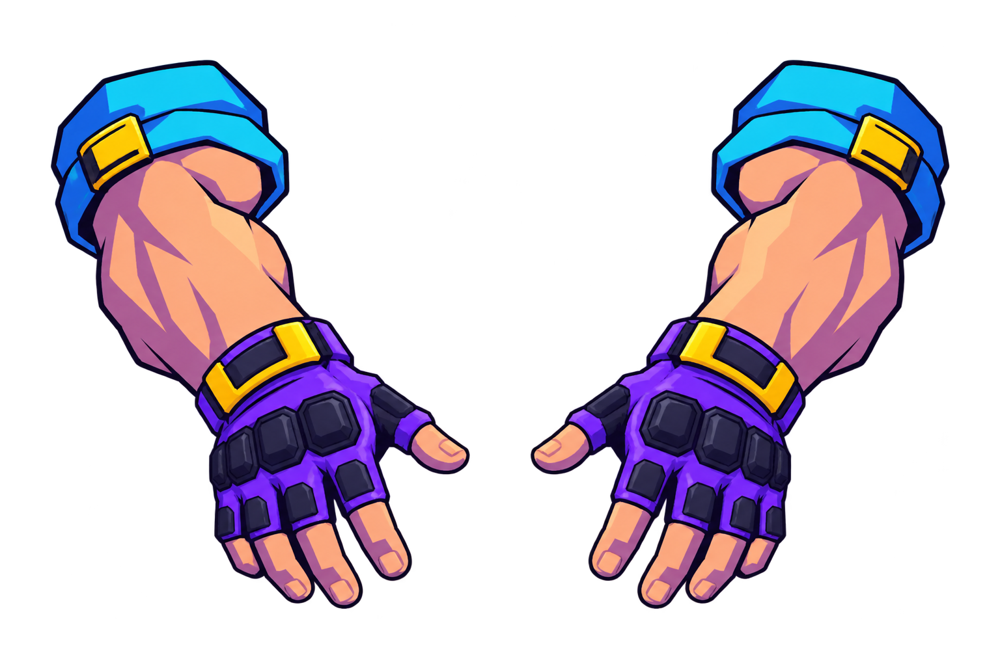

[PNG original](comic/references/arms_gunner_comic_v1.png) · [Prompt exact](comic/prompts/arms_gunner.txt)

À livrer : `arms_gunner.glb` + `arms_gunner.png`. Taille cible : **Avant-bras d’environ 0,40 m**.

## Lot B — Décors de Scrapyard

### Container de couverture — `env_container`

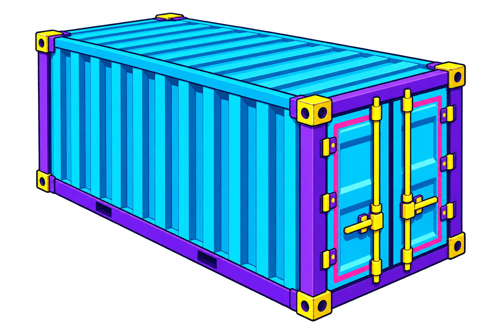

[PNG original](comic/references/env_container_comic_v1.png) · [Prompt exact](comic/prompts/env_container.txt)

À livrer : `env_container.glb` + `env_container.png`. Taille cible : **6 × 3 × 3,20 m (L × P × H)**.

### Caisse de couverture — `env_crate`

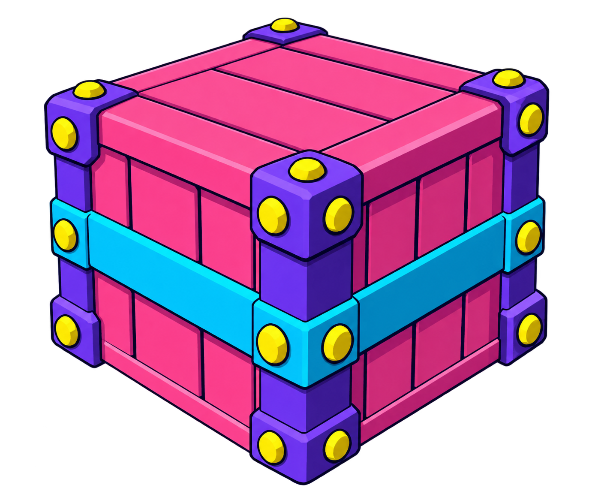

[PNG original](comic/references/env_crate_comic_v1.png) · [Prompt exact](comic/prompts/env_crate.txt)

À livrer : `env_crate.glb` + `env_crate.png`. Taille cible : **3 × 3 × 2 m**.

### Presse industrielle centrale — `env_press`

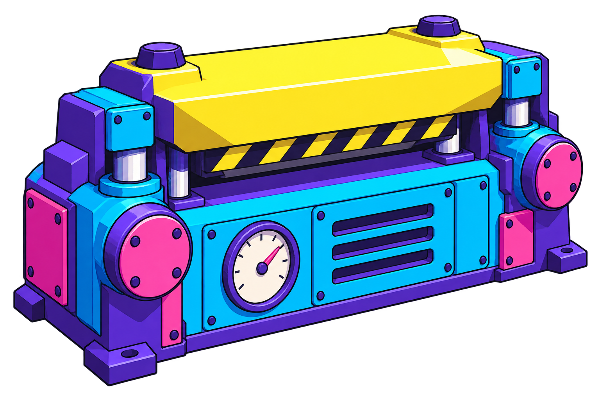

[PNG original](comic/references/env_press_comic_v1.png) · [Prompt exact](comic/prompts/env_press.txt)

À livrer : `env_press.glb` + `env_press.png`. Taille cible : **2,20 × 5,50 × 2,20 m**.

### Coude de tuyau — `env_pipe_elbow`

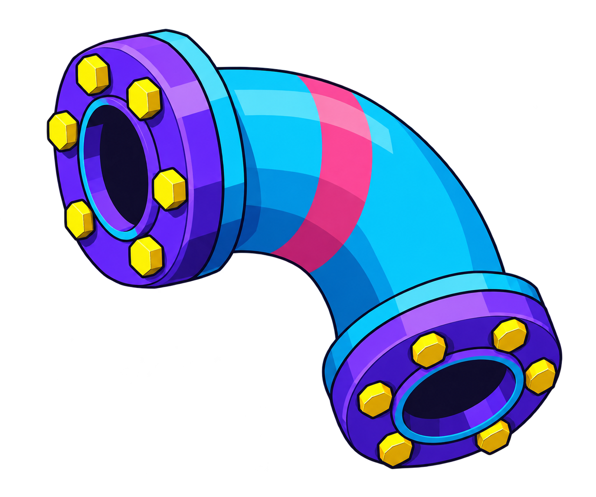

[PNG original](comic/references/env_pipe_elbow_comic_v1.png) · [Prompt exact](comic/prompts/env_pipe_elbow.txt)

À livrer : `env_pipe_elbow.glb` + `env_pipe_elbow.png`. Taille cible : **Diamètre extérieur 0,70 m**.

### Ventilateur industriel — `env_fan`

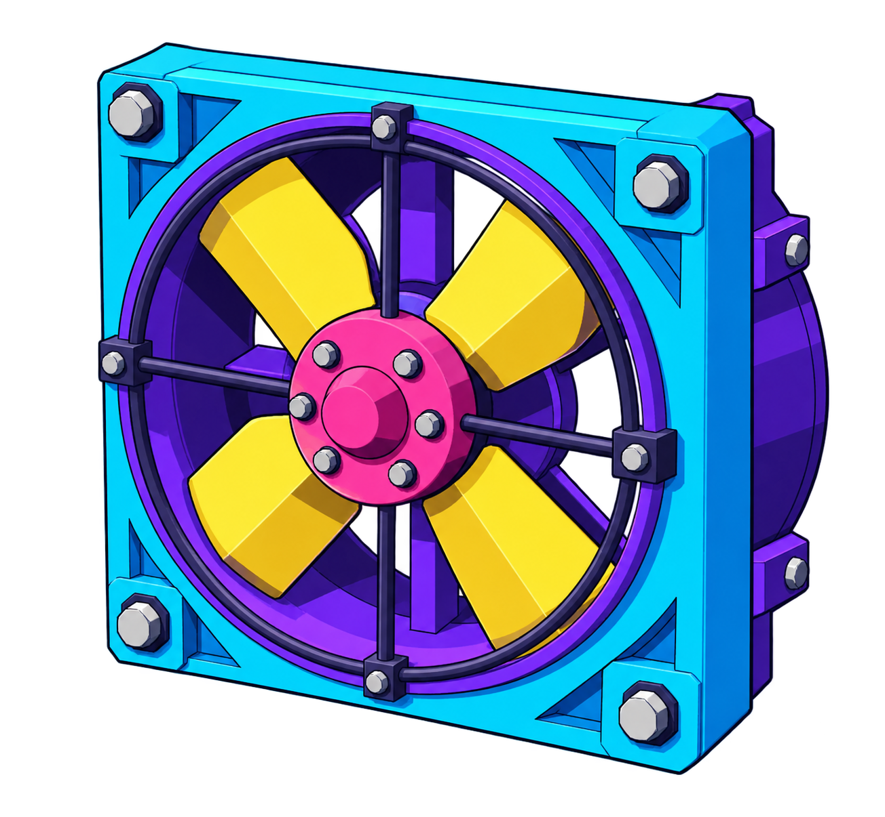

[PNG original](comic/references/env_fan_comic_v1.png) · [Prompt exact](comic/prompts/env_fan.txt)

À livrer : `env_fan.glb` + `env_fan.png`. Taille cible : **2,50 × 0,70 × 2,50 m**.

### Grue portique — `env_gantry_crane`

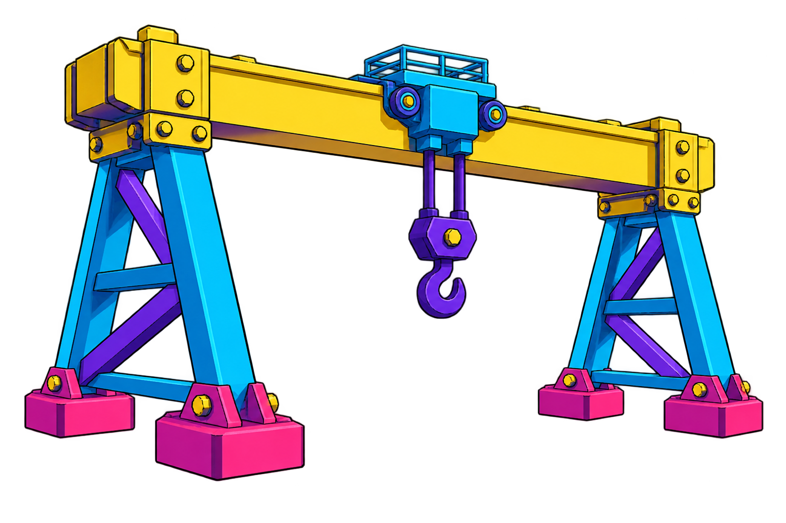

[PNG original](comic/references/env_gantry_crane_comic_v1.png) · [Prompt exact](comic/prompts/env_gantry_crane.txt)

À livrer : `env_gantry_crane.glb` + `env_gantry_crane.png`. Taille cible : **42 m de portée × 20 m de haut**.

### Tas de ferraille — `env_scrap_pile`

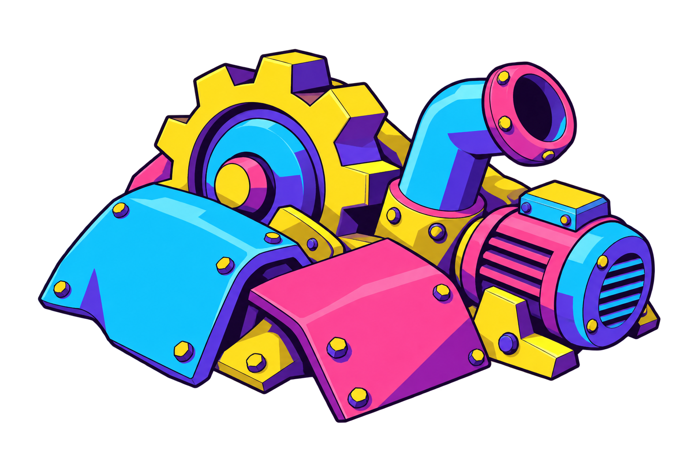

[PNG original](comic/references/env_scrap_pile_comic_v1.png) · [Prompt exact](comic/prompts/env_scrap_pile.txt)

À livrer : `env_scrap_pile.glb` + `env_scrap_pile.png`. Taille cible : **3 × 2 × 1,50 m**.

## Lot C — Brute et Runner

### Brute — `char_brute`

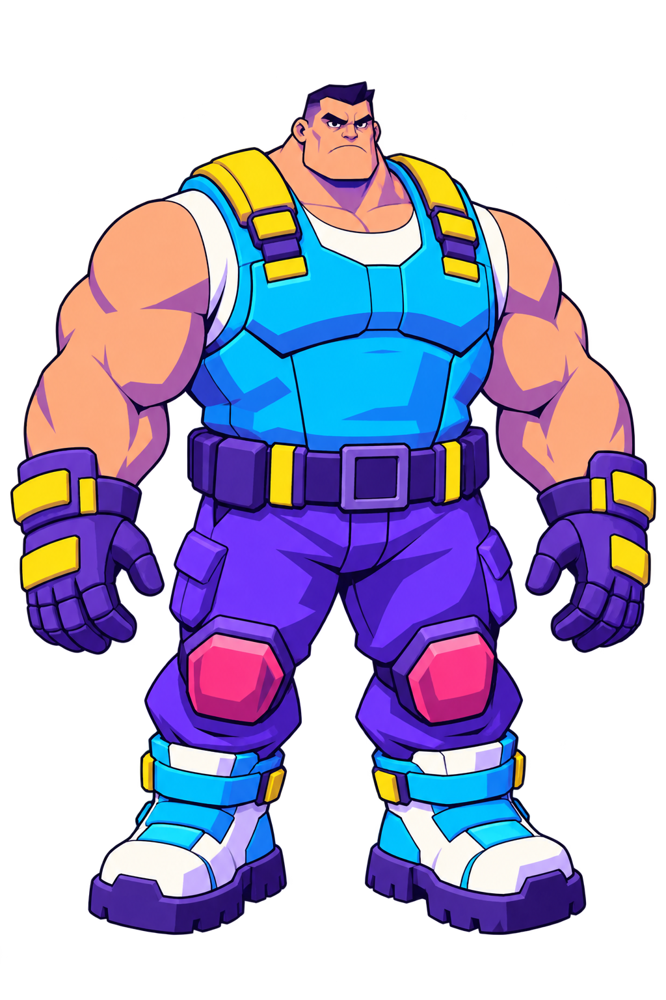

[PNG original](comic/references/char_brute_comic_v1.png) · [Prompt exact](comic/prompts/char_brute.txt)

À livrer : `char_brute.glb` + `char_brute.png`. Taille cible : **2,10 m de haut — silhouette très large**.

### Boomstick — `weapon_boomstick`

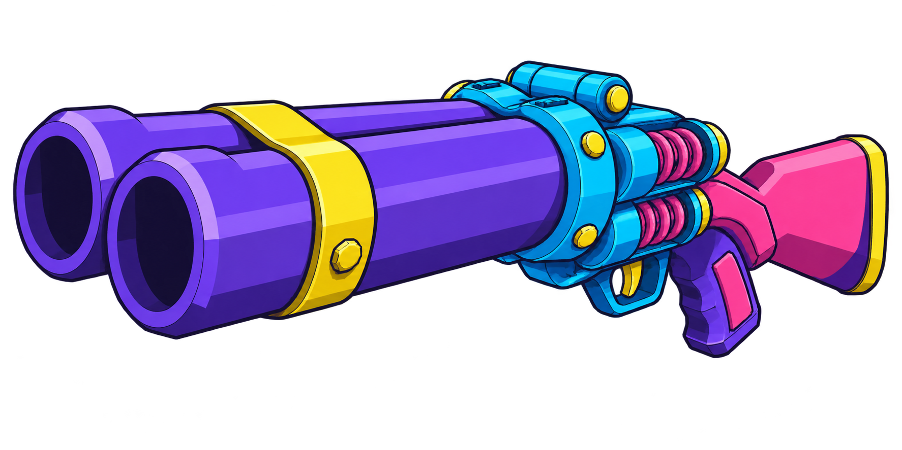

[PNG original](comic/references/weapon_boomstick_comic_v1.png) · [Prompt exact](comic/prompts/weapon_boomstick.txt)

À livrer : `weapon_boomstick.glb` + `weapon_boomstick.png`. Taille cible : **1,15 m de long**.

### Knuckle Cannon — `weapon_knuckle_cannon`

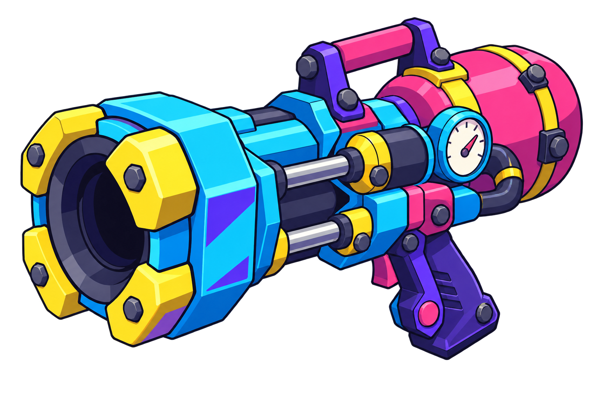

[PNG original](comic/references/weapon_knuckle_cannon_comic_v1.png) · [Prompt exact](comic/prompts/weapon_knuckle_cannon.txt)

À livrer : `weapon_knuckle_cannon.glb` + `weapon_knuckle_cannon.png`. Taille cible : **0,95 m de long**.

### Projectile du Knuckle Cannon — `projectile_knuckle`

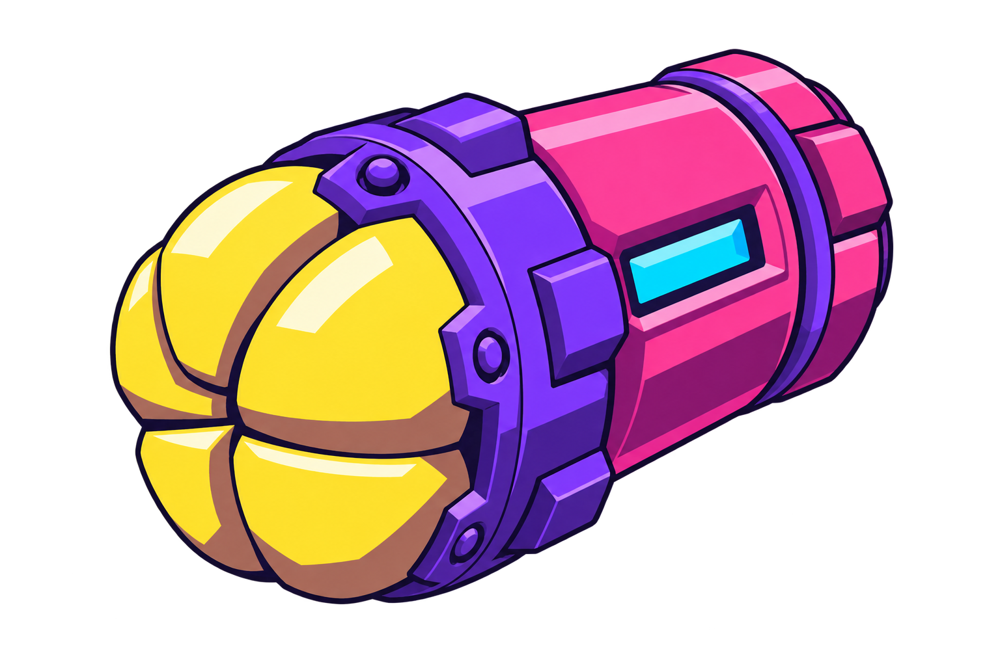

[PNG original](comic/references/projectile_knuckle_comic_v1.png) · [Prompt exact](comic/prompts/projectile_knuckle.txt)

À livrer : `projectile_knuckle.glb` + `projectile_knuckle.png`. Taille cible : **0,45 m de diamètre**.

### Runner — `char_runner`

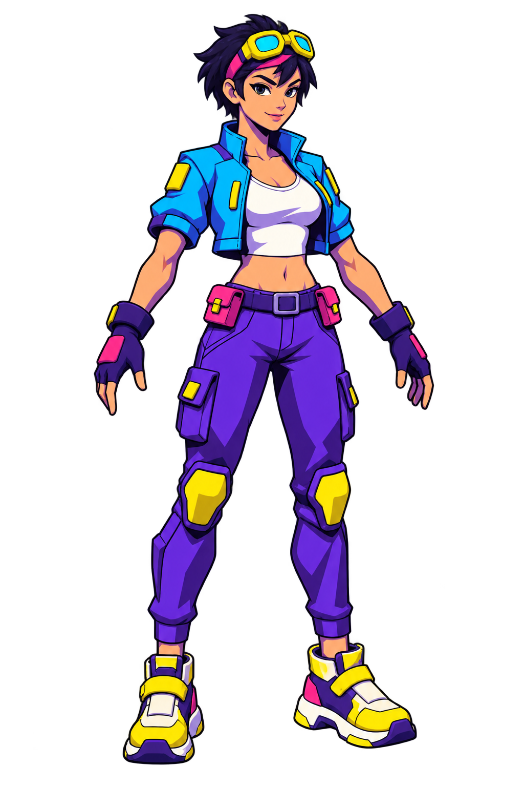

[PNG original](comic/references/char_runner_comic_v1.png) · [Prompt exact](comic/prompts/char_runner.txt)

À livrer : `char_runner.glb` + `char_runner.png`. Taille cible : **1,70 m de haut — silhouette fine**.

### SMG — `weapon_smg`

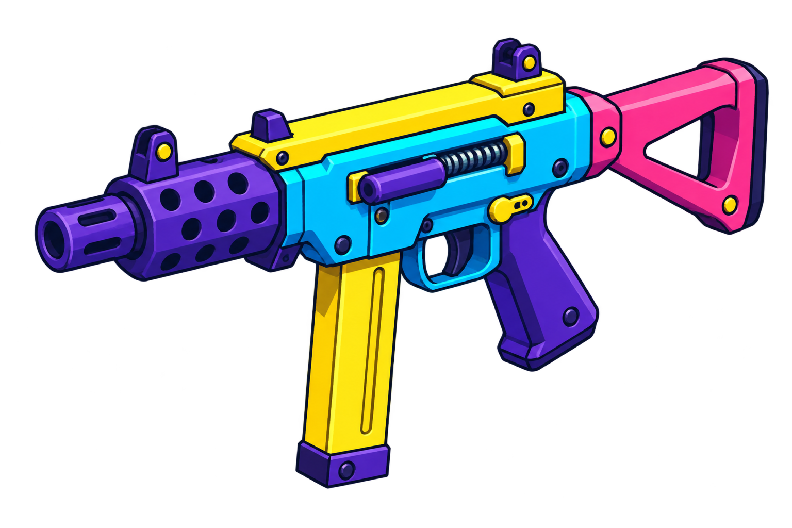

[PNG original](comic/references/weapon_smg_comic_v1.png) · [Prompt exact](comic/prompts/weapon_smg.txt)

À livrer : `weapon_smg.glb` + `weapon_smg.png`. Taille cible : **0,65 m de long**.

### Sawed-Off — `weapon_sawed_off`

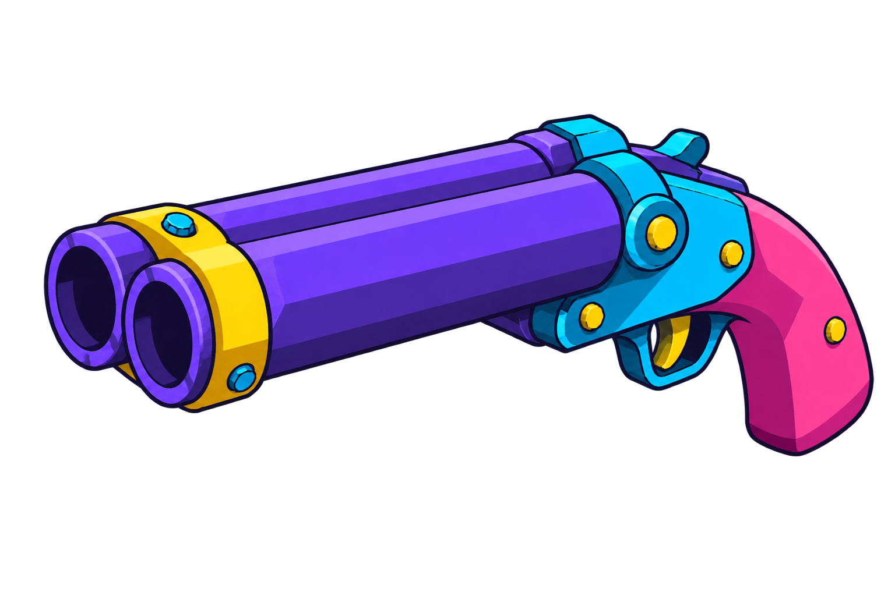

[PNG original](comic/references/weapon_sawed_off_comic_v1.png) · [Prompt exact](comic/prompts/weapon_sawed_off.txt)

À livrer : `weapon_sawed_off.glb` + `weapon_sawed_off.png`. Taille cible : **0,48 m de long**.

## Lot D — Pickups et interactions

### Small Health — `pickup_health_small`

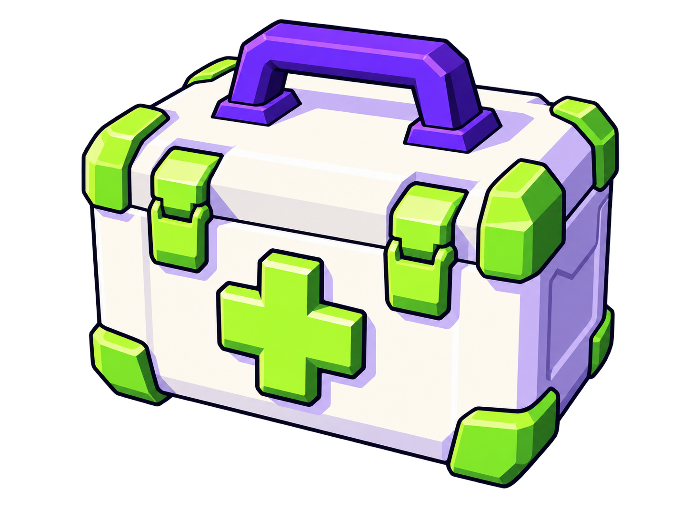

[PNG original](comic/references/pickup_health_small_comic_v1.png) · [Prompt exact](comic/prompts/pickup_health_small.txt)

À livrer : `pickup_health_small.glb` + `pickup_health_small.png`. Taille cible : **0,45 × 0,30 × 0,35 m**.

### Mega Health — `pickup_health_mega`

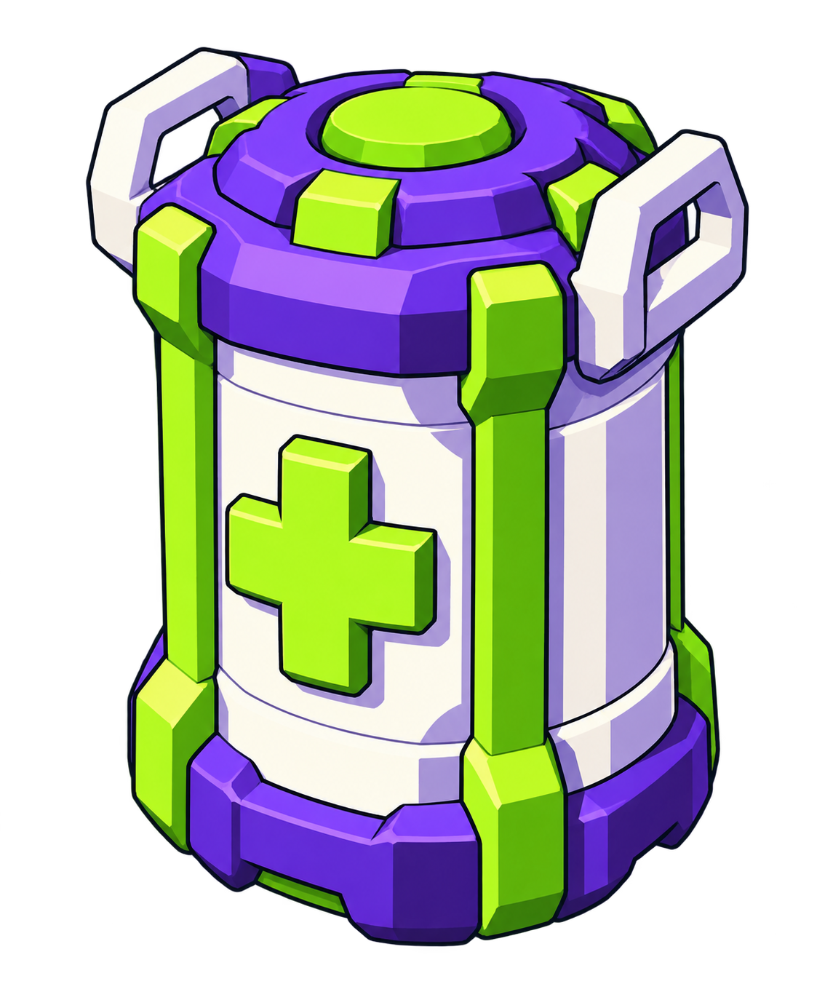

[PNG original](comic/references/pickup_health_mega_comic_v1.png) · [Prompt exact](comic/prompts/pickup_health_mega.txt)

À livrer : `pickup_health_mega.glb` + `pickup_health_mega.png`. Taille cible : **0,65 × 0,45 × 0,80 m**.

### Armor — `pickup_armor`

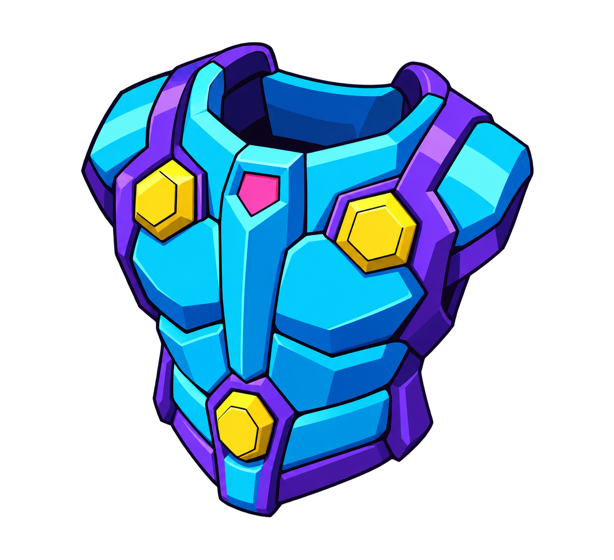

[PNG original](comic/references/pickup_armor_comic_v1.png) · [Prompt exact](comic/prompts/pickup_armor.txt)

À livrer : `pickup_armor.glb` + `pickup_armor.png`. Taille cible : **0,70 m de haut**.

### Overdrive Canister — `pickup_overdrive`

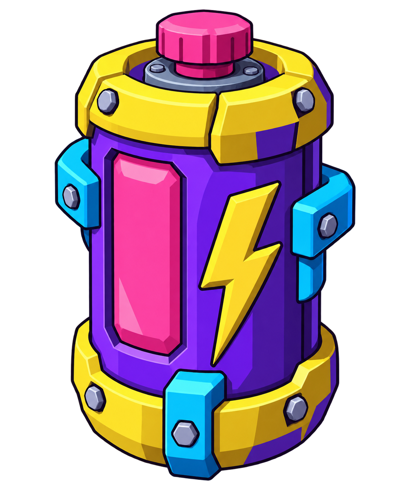

[PNG original](comic/references/pickup_overdrive_comic_v1.png) · [Prompt exact](comic/prompts/pickup_overdrive.txt)

À livrer : `pickup_overdrive.glb` + `pickup_overdrive.png`. Taille cible : **0,55 m de haut**.

### Baril explosif — `prop_explosive_barrel`

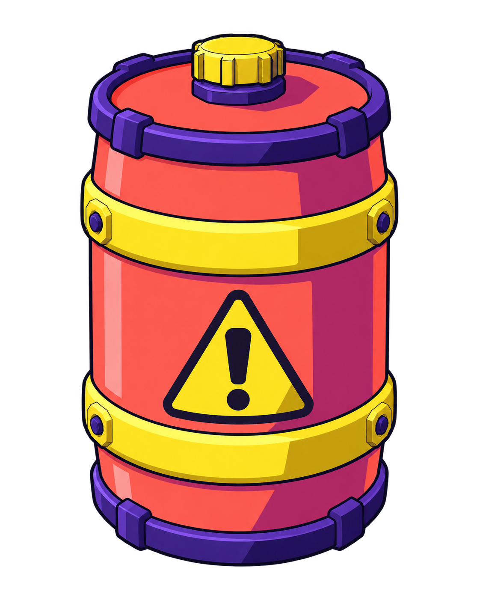

[PNG original](comic/references/prop_explosive_barrel_comic_v1.png) · [Prompt exact](comic/prompts/prop_explosive_barrel.txt)

À livrer : `prop_explosive_barrel.glb` + `prop_explosive_barrel.png`. Taille cible : **0,85 m de diamètre × 1,25 m de haut**.

### Bouton de danger — `prop_hazard_button`

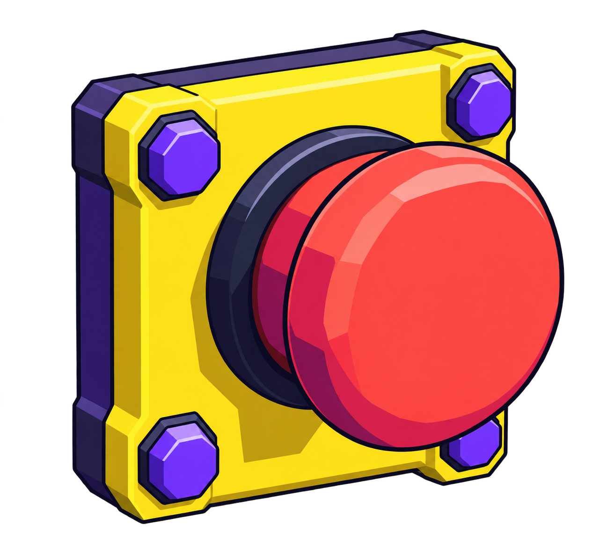

[PNG original](comic/references/prop_hazard_button_comic_v1.png) · [Prompt exact](comic/prompts/prop_hazard_button.txt)

À livrer : `prop_hazard_button.glb` + `prop_hazard_button.png`. Taille cible : **0,45 × 0,20 × 0,60 m**.

### Jump Pad — `prop_jump_pad`

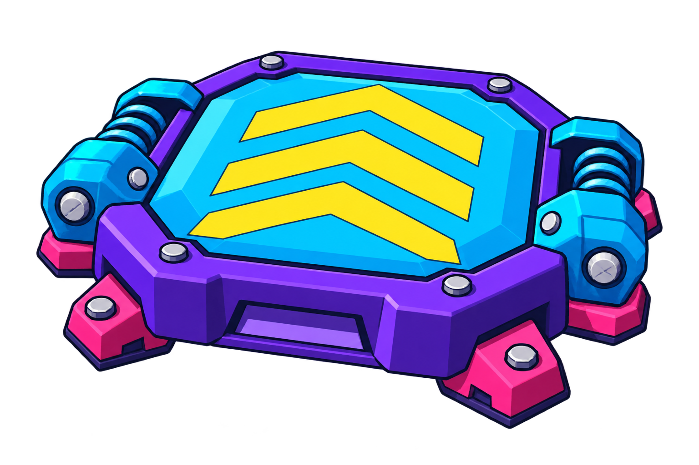

[PNG original](comic/references/prop_jump_pad_comic_v1.png) · [Prompt exact](comic/prompts/prop_jump_pad.txt)

À livrer : `prop_jump_pad.glb` + `prop_jump_pad.png`. Taille cible : **2,50 × 2,50 × 0,35 m**.
