# HOTSHOT — Les 26 références 3/4

**26/26 images générées**, une référence PNG par asset, dans la direction artistique cartoon industrielle HOTSHOT.

Chaque image a été vérifiée visuellement : asset entier, silhouette lisible et cohérence de palette. Les 26 PNG ont été ouverts et leur canal de transparence vérifié. Ce sont les références pour générer les GLB ; les PNG de HUD seront livrés avec les modèles selon le processus convenu.

Les [dimensions et consignes de production](ASSET_PRODUCTION.md) complètent ces images. Dépose ensuite les fichiers dans [incoming/](incoming/), avec le nom indiqué sous chaque référence.

## Lot A — Gunner

### Gunner — `char_gunner`

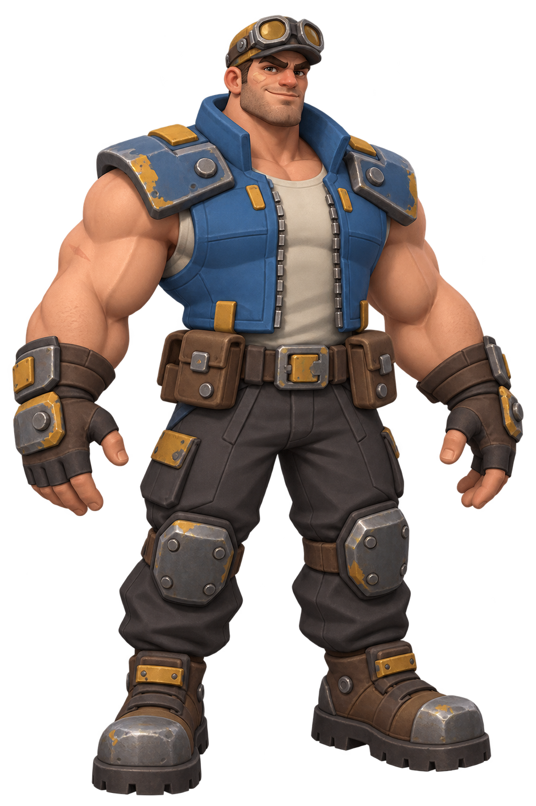

[PNG original](references/char_gunner_3q_v1.png) · [Prompt exact utilisé](prompts/generated/char_gunner_3q_v1.txt)

À livrer : `char_gunner.glb` + `char_gunner.png`. Taille cible : 1,85 m de haut.

### Assault Rifle — `weapon_assault_rifle`

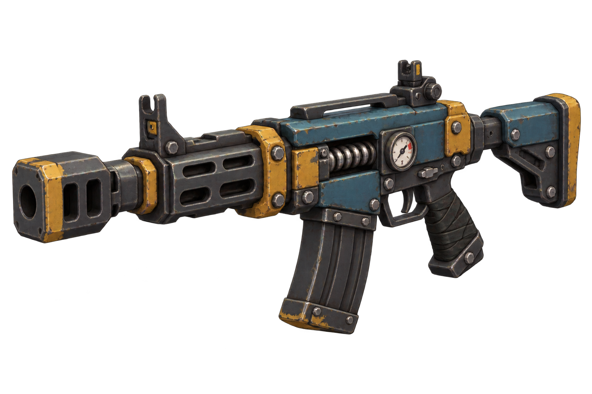

[PNG original](references/weapon_assault_rifle_3q_v2.png) · [Prompt exact utilisé](prompts/generated/weapon_assault_rifle_3q_v2.txt)

**Livré et intégré** : [GLB](../public/assets/weapons/weapon_assault_rifle.glb) + [PNG du HUD](../public/assets/weapons/weapon_assault_rifle.png). Longueur en jeu : 1,05 m. Utilisé en vue FPS et chez l’adversaire.

### Grenade Launcher — `weapon_grenade_launcher`

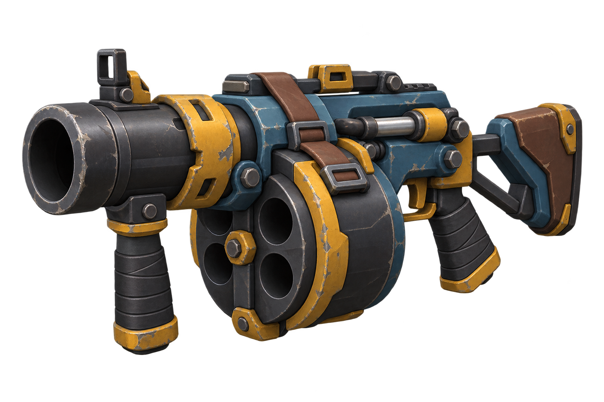

[PNG original](references/weapon_grenade_launcher_3q_v1.png) · [Prompt exact utilisé](prompts/generated/weapon_grenade_launcher_3q_v1.txt)

À livrer : `weapon_grenade_launcher.glb` + `weapon_grenade_launcher.png`. Taille cible : 0,85 m de long.

### Grenade — `projectile_grenade`

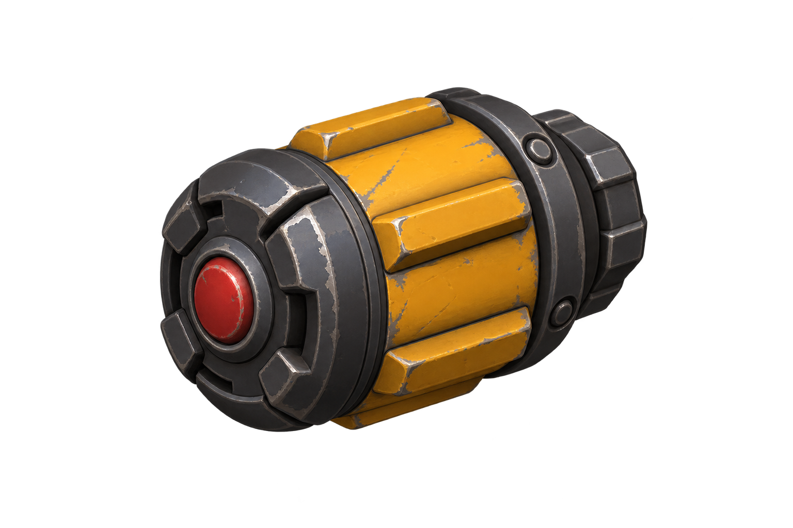

[PNG original](references/projectile_grenade_3q_v1.png) · [Prompt exact utilisé](prompts/generated/projectile_grenade_3q_v1.txt)

À livrer : `projectile_grenade.glb` + `projectile_grenade.png`. Taille cible : 0,28 m de diamètre.

### Bras FPS du Gunner — `arms_gunner`

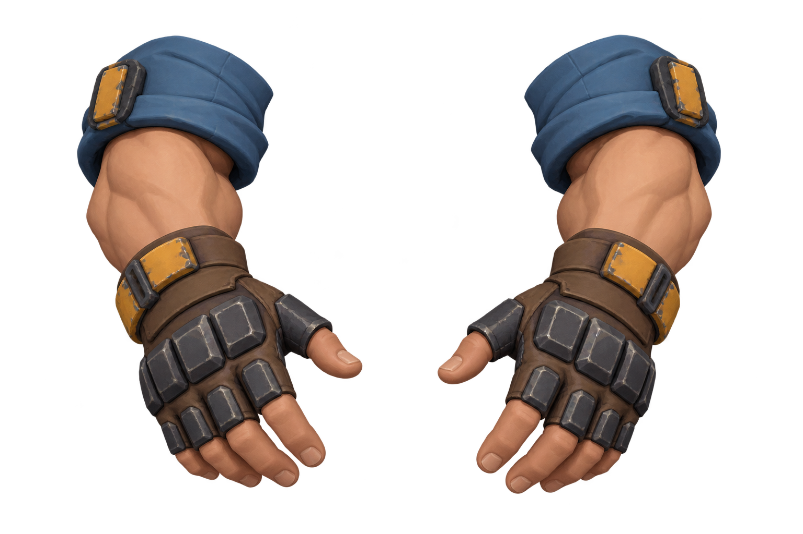

[PNG original](references/arms_gunner_3q_v1.png) · [Prompt exact utilisé](prompts/generated/arms_gunner_3q_v1.txt)

À livrer : `arms_gunner.glb` + `arms_gunner.png`. Taille cible : Avant-bras d’environ 0,40 m.

## Lot B — Décor de Scrapyard

### Container de couverture — `env_container`

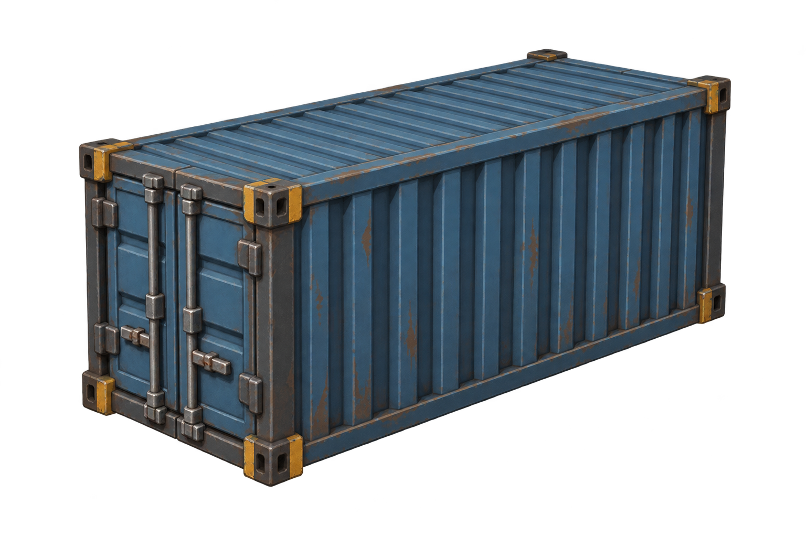

[PNG original](references/env_container_3q_v1.png) · [Prompt exact utilisé](prompts/generated/env_container_3q_v1.txt)

À livrer : `env_container.glb` + `env_container.png`. Taille cible : 6 × 3 × 3,20 m (L × P × H).

### Caisse de couverture — `env_crate`

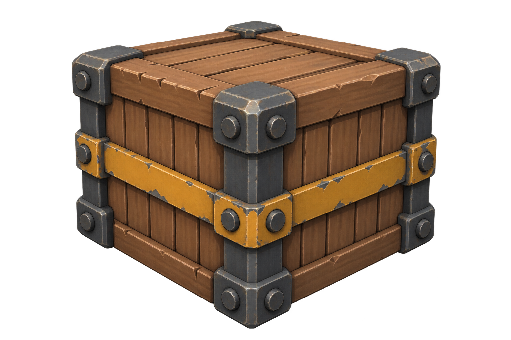

[PNG original](references/env_crate_3q_v1.png) · [Prompt exact utilisé](prompts/generated/env_crate_3q_v1.txt)

À livrer : `env_crate.glb` + `env_crate.png`. Taille cible : 3 × 3 × 2 m.

### Presse industrielle centrale — `env_press`

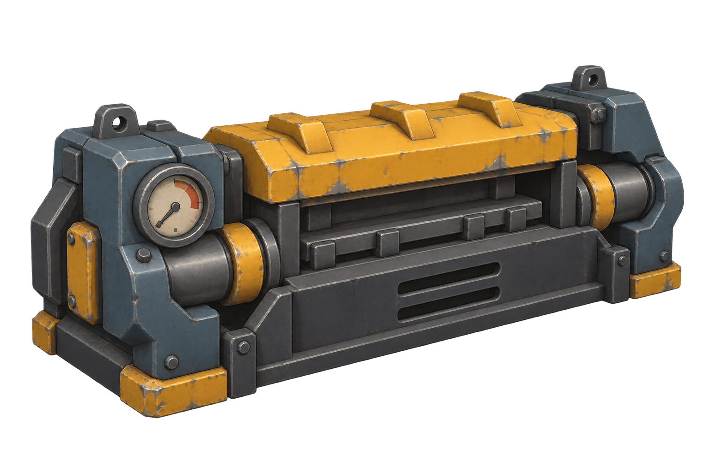

[PNG original](references/env_press_3q_v1.png) · [Prompt exact utilisé](prompts/generated/env_press_3q_v1.txt)

À livrer : `env_press.glb` + `env_press.png`. Taille cible : 2,20 × 5,50 × 2,20 m.

### Coude de tuyau — `env_pipe_elbow`

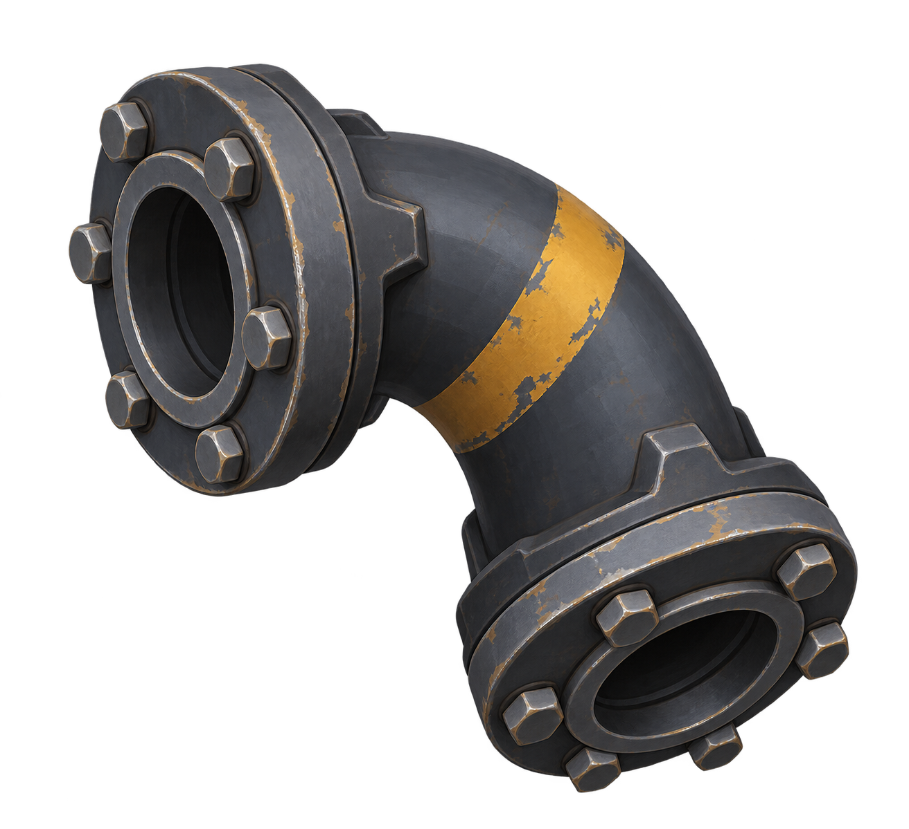

[PNG original](references/env_pipe_elbow_3q_v1.png) · [Prompt exact utilisé](prompts/generated/env_pipe_elbow_3q_v1.txt)

À livrer : `env_pipe_elbow.glb` + `env_pipe_elbow.png`. Taille cible : Diamètre extérieur 0,70 m.

### Ventilateur industriel — `env_fan`

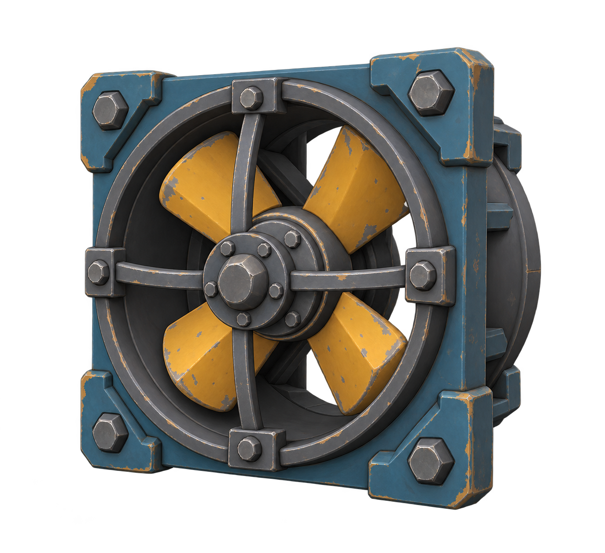

[PNG original](references/env_fan_3q_v1.png) · [Prompt exact utilisé](prompts/generated/env_fan_3q_v1.txt)

À livrer : `env_fan.glb` + `env_fan.png`. Taille cible : 2,50 × 0,70 × 2,50 m.

### Grue portique — `env_gantry_crane`

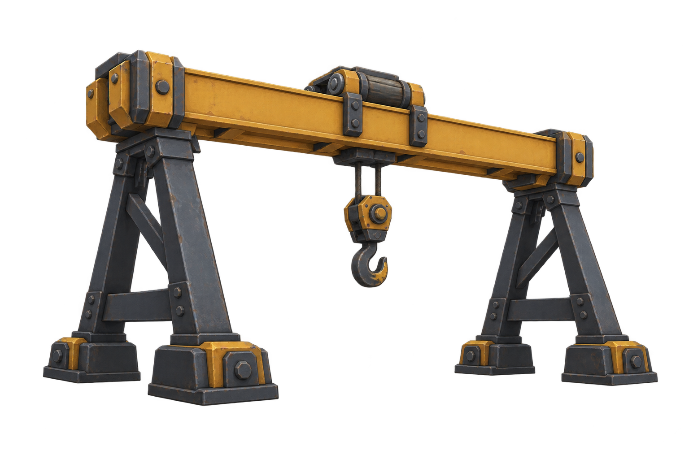

[PNG original](references/env_gantry_crane_3q_v1.png) · [Prompt exact utilisé](prompts/generated/env_gantry_crane_3q_v1.txt)

À livrer : `env_gantry_crane.glb` + `env_gantry_crane.png`. Taille cible : 42 m de portée × 20 m de haut.

### Tas de ferraille — `env_scrap_pile`

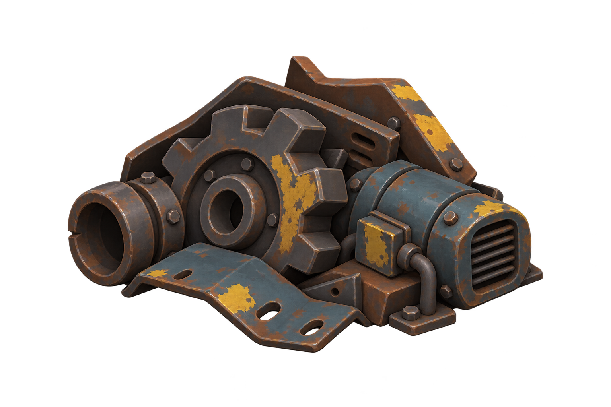

[PNG original](references/env_scrap_pile_3q_v1.png) · [Prompt exact utilisé](prompts/generated/env_scrap_pile_3q_v1.txt)

À livrer : `env_scrap_pile.glb` + `env_scrap_pile.png`. Taille cible : 3 × 2 × 1,50 m.

## Lot C — Brute et Runner

### Brute — `char_brute`

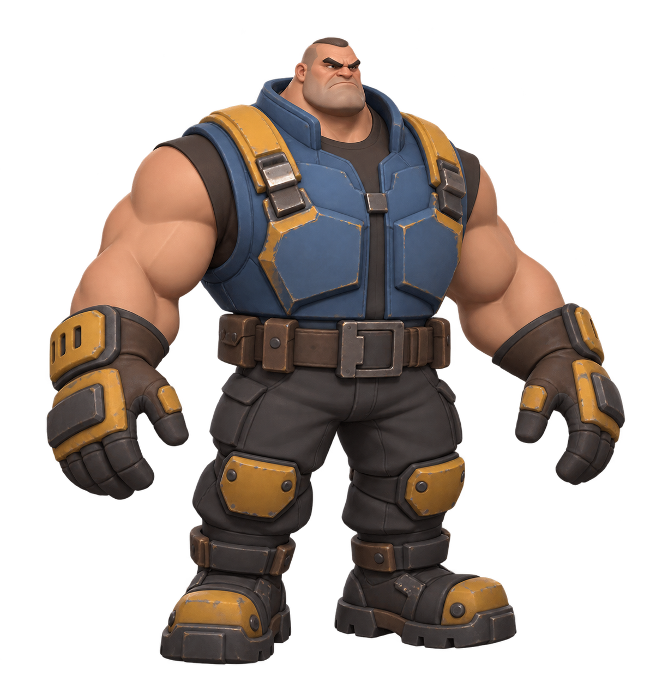

[PNG original](references/char_brute_3q_v1.png) · [Prompt exact utilisé](prompts/generated/char_brute_3q_v1.txt)

À livrer : `char_brute.glb` + `char_brute.png`. Taille cible : 2,10 m de haut — silhouette très large.

### Boomstick — `weapon_boomstick`

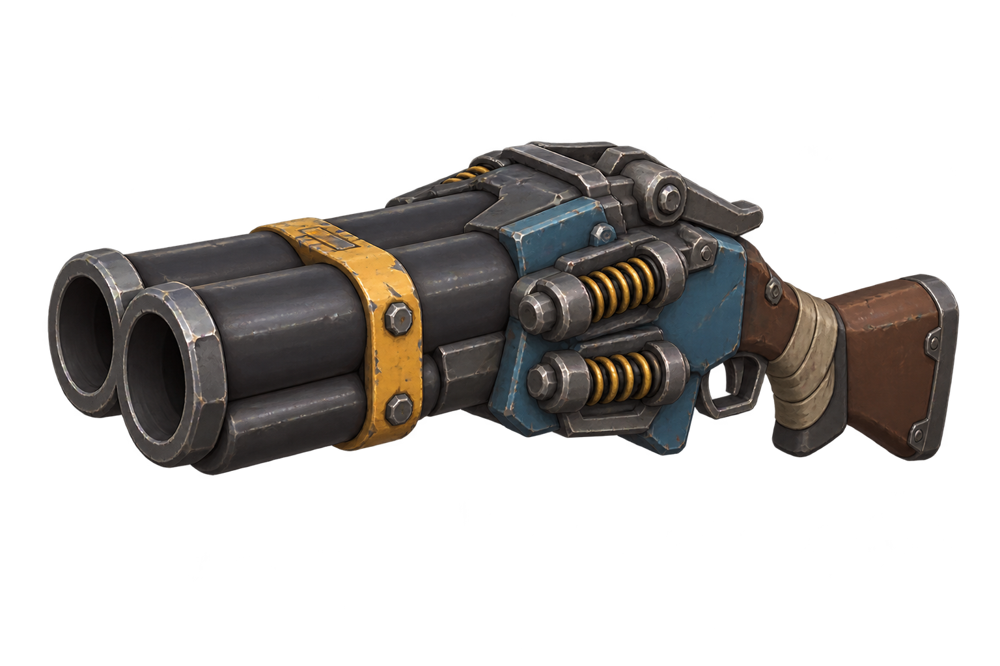

[PNG original](references/weapon_boomstick_3q_v1.png) · [Prompt exact utilisé](prompts/generated/weapon_boomstick_3q_v1.txt)

À livrer : `weapon_boomstick.glb` + `weapon_boomstick.png`. Taille cible : 1,15 m de long.

### Knuckle Cannon — `weapon_knuckle_cannon`

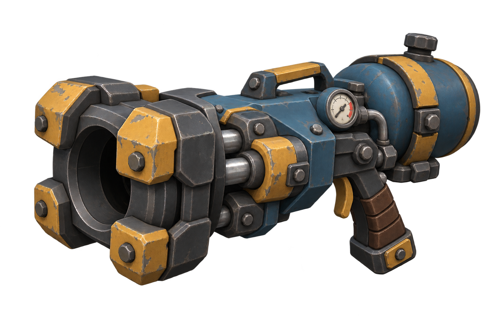

[PNG original](references/weapon_knuckle_cannon_3q_v1.png) · [Prompt exact utilisé](prompts/generated/weapon_knuckle_cannon_3q_v1.txt)

À livrer : `weapon_knuckle_cannon.glb` + `weapon_knuckle_cannon.png`. Taille cible : 0,95 m de long.

### Projectile du Knuckle Cannon — `projectile_knuckle`

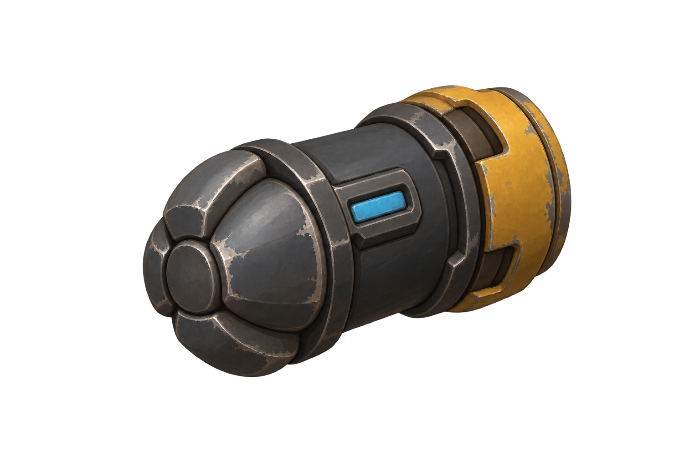

[PNG original](references/projectile_knuckle_3q_v1.png) · [Prompt exact utilisé](prompts/generated/projectile_knuckle_3q_v1.txt)

À livrer : `projectile_knuckle.glb` + `projectile_knuckle.png`. Taille cible : 0,45 m de diamètre.

### Runner — `char_runner`

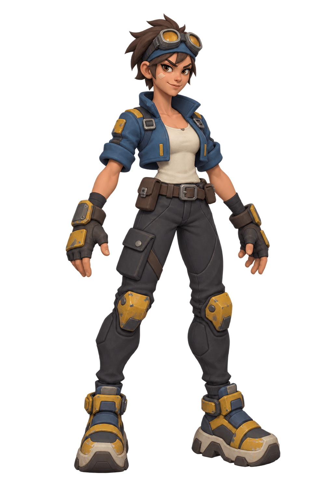

[PNG original](references/char_runner_3q_v1.png) · [Prompt exact utilisé](prompts/generated/char_runner_3q_v1.txt)

À livrer : `char_runner.glb` + `char_runner.png`. Taille cible : 1,70 m de haut — silhouette fine.

### SMG — `weapon_smg`

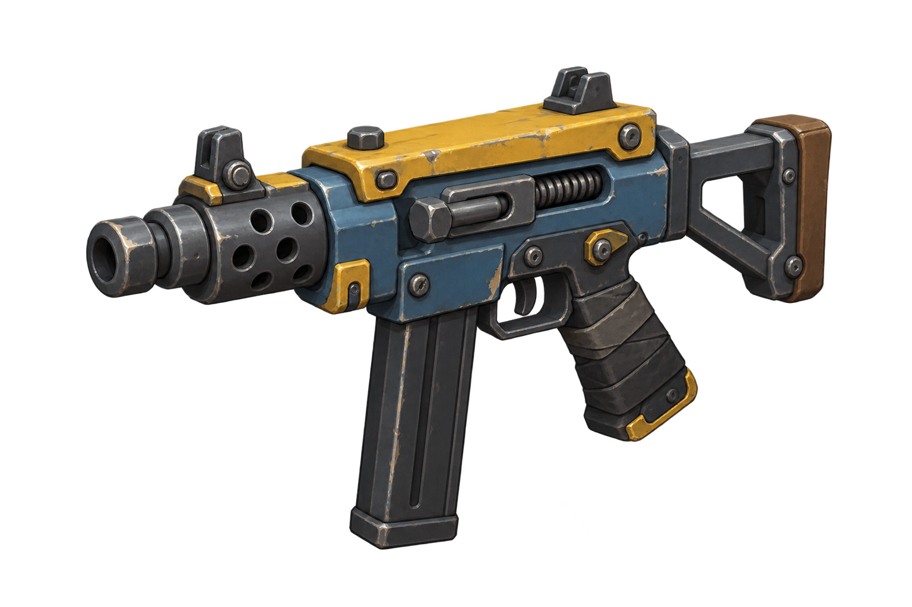

[PNG original](references/weapon_smg_3q_v1.png) · [Prompt exact utilisé](prompts/generated/weapon_smg_3q_v1.txt)

À livrer : `weapon_smg.glb` + `weapon_smg.png`. Taille cible : 0,65 m de long.

### Sawed-Off — `weapon_sawed_off`

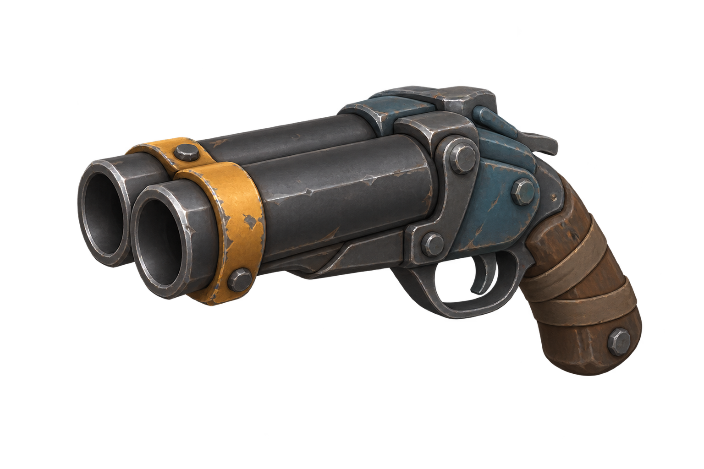

[PNG original](references/weapon_sawed_off_3q_v1.png) · [Prompt exact utilisé](prompts/generated/weapon_sawed_off_3q_v1.txt)

À livrer : `weapon_sawed_off.glb` + `weapon_sawed_off.png`. Taille cible : 0,48 m de long.

## Lot D — Bonus et interactions

### Small Health — `pickup_health_small`

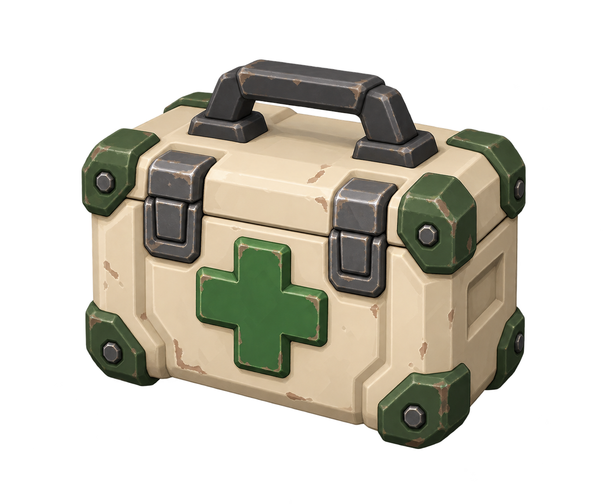

[PNG original](references/pickup_health_small_3q_v1.png) · [Prompt exact utilisé](prompts/generated/pickup_health_small_3q_v1.txt)

À livrer : `pickup_health_small.glb` + `pickup_health_small.png`. Taille cible : 0,45 × 0,30 × 0,35 m.

### Mega Health — `pickup_health_mega`

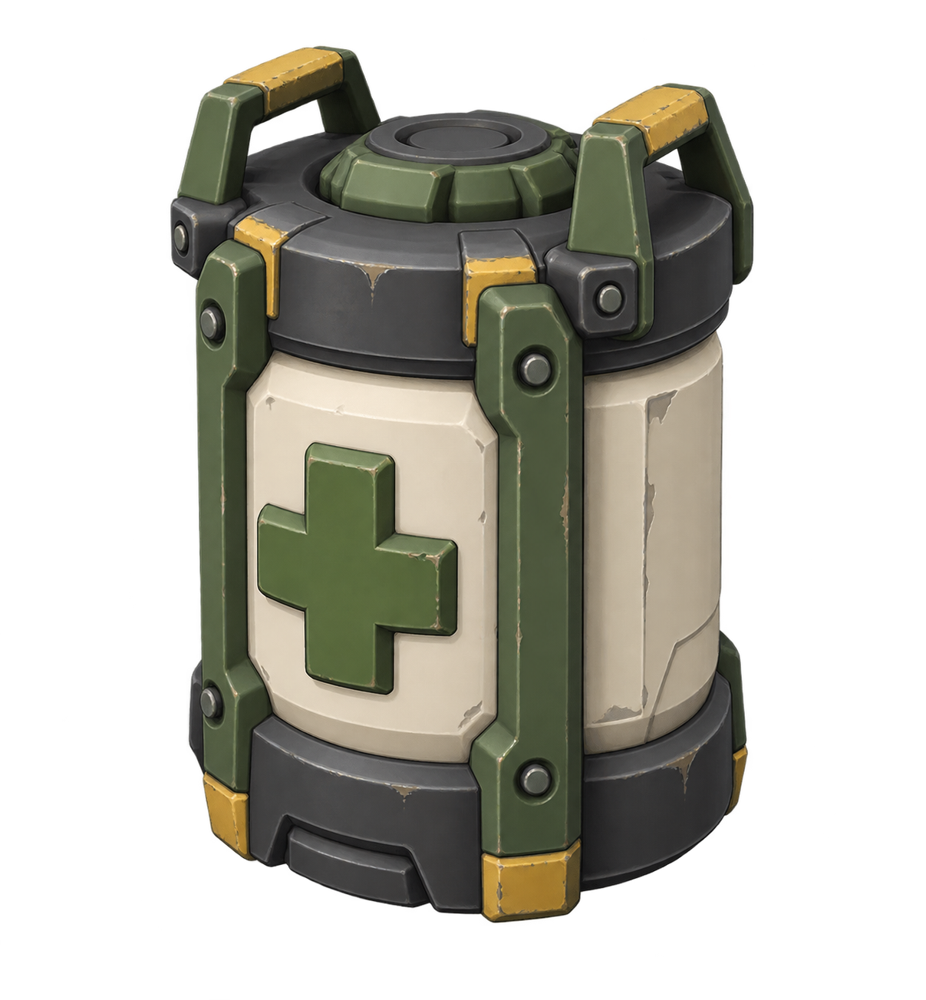

[PNG original](references/pickup_health_mega_3q_v1.png) · [Prompt exact utilisé](prompts/generated/pickup_health_mega_3q_v1.txt)

À livrer : `pickup_health_mega.glb` + `pickup_health_mega.png`. Taille cible : 0,65 × 0,45 × 0,80 m.

### Armor — `pickup_armor`

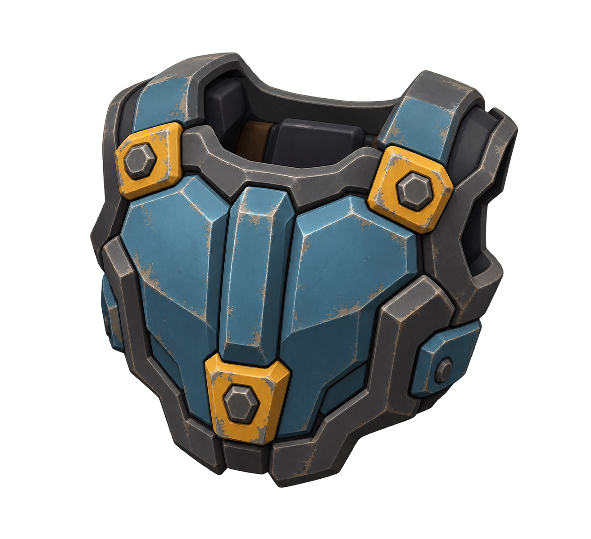

[PNG original](references/pickup_armor_3q_v1.png) · [Prompt exact utilisé](prompts/generated/pickup_armor_3q_v1.txt)

À livrer : `pickup_armor.glb` + `pickup_armor.png`. Taille cible : 0,70 m de haut.

### Overdrive Canister — `pickup_overdrive`

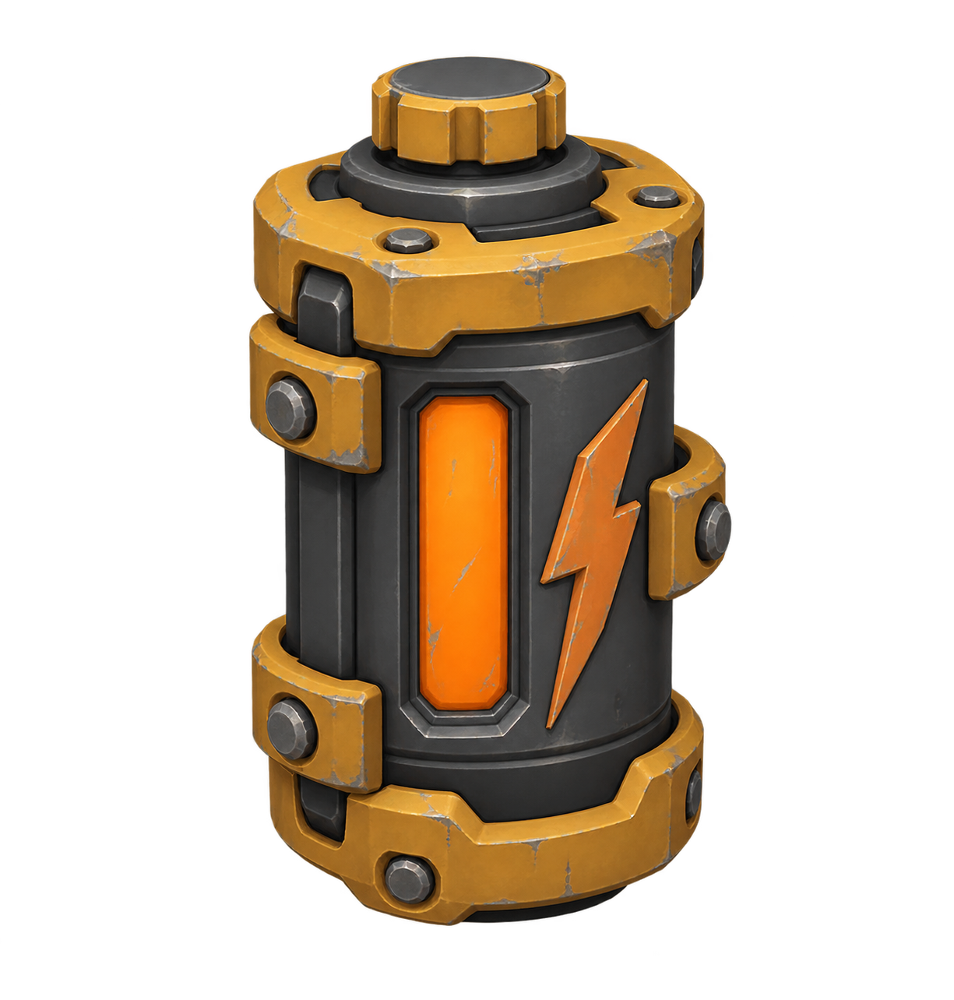

[PNG original](references/pickup_overdrive_3q_v1.png) · [Prompt exact utilisé](prompts/generated/pickup_overdrive_3q_v1.txt)

À livrer : `pickup_overdrive.glb` + `pickup_overdrive.png`. Taille cible : 0,55 m de haut.

### Baril explosif — `prop_explosive_barrel`

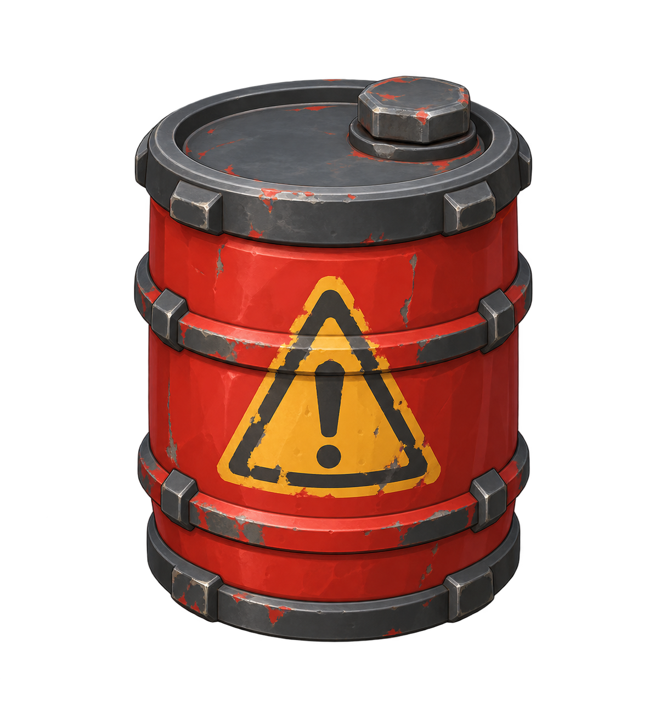

[PNG original](references/prop_explosive_barrel_3q_v1.png) · [Prompt exact utilisé](prompts/generated/prop_explosive_barrel_3q_v1.txt)

À livrer : `prop_explosive_barrel.glb` + `prop_explosive_barrel.png`. Taille cible : 0,85 m de diamètre × 1,25 m de haut.

### Bouton de danger — `prop_hazard_button`

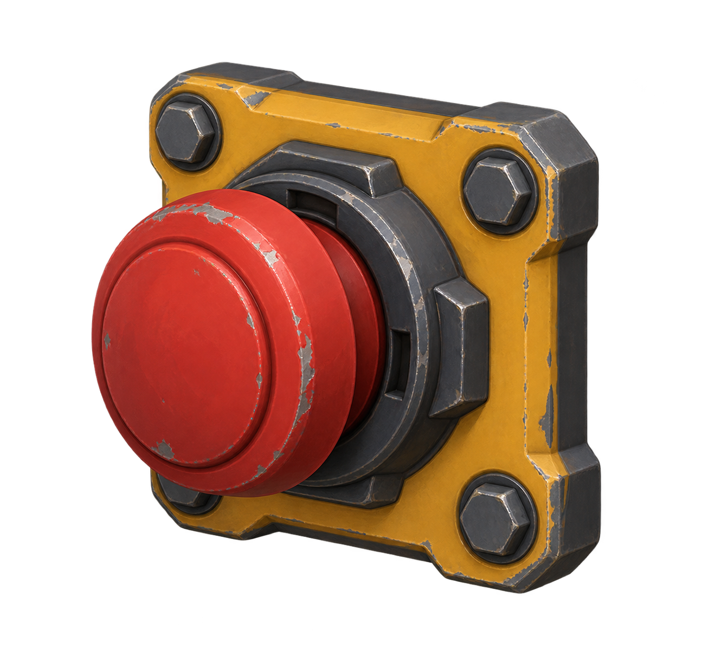

[PNG original](references/prop_hazard_button_3q_v1.png) · [Prompt exact utilisé](prompts/generated/prop_hazard_button_3q_v1.txt)

À livrer : `prop_hazard_button.glb` + `prop_hazard_button.png`. Taille cible : 0,45 × 0,20 × 0,60 m.

### Jump Pad — `prop_jump_pad`

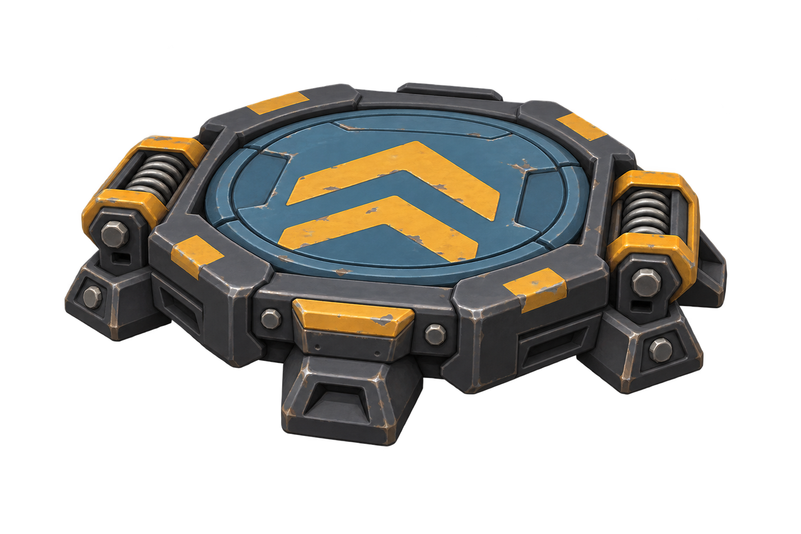

[PNG original](references/prop_jump_pad_3q_v1.png) · [Prompt exact utilisé](prompts/generated/prop_jump_pad_3q_v1.txt)

À livrer : `prop_jump_pad.glb` + `prop_jump_pad.png`. Taille cible : 2,50 × 2,50 × 0,35 m.
